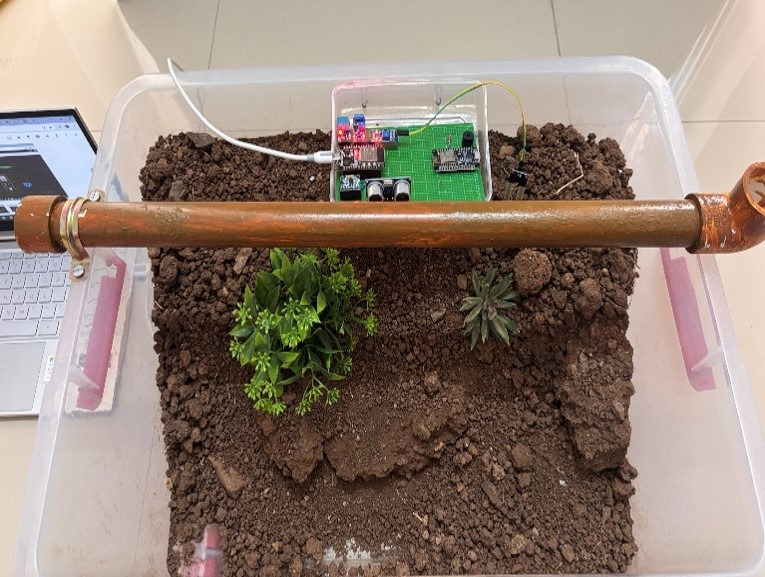
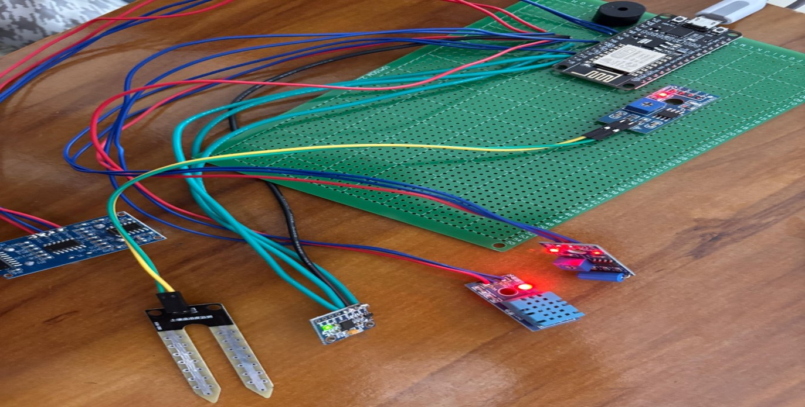

# 🌍 Landslide Monitoring and Prediction using Machine Learning

This project is a real-time **Landslide Monitoring and Prediction System** using **sensor integration** and an **LSTM machine learning model**. It combines IoT, embedded systems, and AI to predict potential landslides and raise alerts.

---

## 📌 Project Overview

The goal of this project is to **monitor soil and environmental conditions** and predict landslides before they happen, minimizing risk and enabling early warning systems.

The system uses sensors to gather data, which is processed by a **Long Short-Term Memory (LSTM)** machine learning model trained to recognize landslide patterns.

---

## 👨‍🔬 Project Planning & Sponsorship

This project was ideated and developed by:
- **Aditi Sarraf**
- **Swaroop Sawale**
- **Parth Pol**

We received **technical planning and plotting support from TechSphere TDL**, which helped guide the system architecture and early simulation models.

---

## 🧰 Hardware Components Used

| Sensor/Module        | Purpose                                               |
|----------------------|-------------------------------------------------------|
| **Soil Moisture Sensor** | Measures the soil's moisture level                 |
| **DHT11**               | Captures ambient temperature and humidity           |
| **MPU6050**             | Detects acceleration in X, Y, Z axes for sliding    |
| **Vibration Sensor**    | Detects tremors in the soil                         |
| **ESP32-WROOM**         | Microcontroller for Wi-Fi and Bluetooth communication |
| **Buzzer**              | Alerts when landslide is predicted                  |

---

## 💻 Simulation Phase

- **Wokwi** simulator was used to virtually connect and test hardware components.
- The virtual circuit was coded and integrated with **ESP32-WROOM**.
- Data was sent to **ThingSpeak**, which generated a real-time API.

---

## 🔗 ThingSpeak Integration

ThingSpeak provided:
- Live cloud monitoring of sensor values
- A unique API key to fetch data in real time
- Charts to visualize environmental changes

---

## 🧠 Machine Learning Phase (LSTM Model)

- Built in **VS Code using Python**
- **LSTM model** trained on:
  - Soil moisture
  - Humidity
  - Temperature
  - Acceleration (X, Y, Z)
  - Vibration
- The model takes the **last 10 values** and predicts if a landslide is imminent.

---

## 🔧 Real Hardware Implementation

- A **dummy landslide model** was created physically
- All sensors were embedded and connected to **ESP32-WROOM**
- Code was written in **Arduino IDE**
- If sensor data crosses a threshold and ML model predicts landslide:
  - **Buzzer activates as a warning**

---

## 📣 Features

- ✅ Real-time monitoring  
- ✅ Early warning system  
- ✅ Machine learning-based prediction  
- ✅ Cloud integration with ThingSpeak  
- ✅ Fully tested on physical model

---

## 📸 Project Images

### 1. Landslide Model

  

### 2. Sensor Integration

  

---

## 🏁 Project Status

✅ Completed prototype  
✅ Cloud connected  
✅ ML prediction functional  
✅ Successfully tested on dummy setup

---

## 👥 Team Members

- **Swaroop Sawale** – ML integration & hardware logic  
- **Aditi Saraf** – Sensor integration and data flow  
- **Parth Pol** – Virtual simulation, coding & testing

---

## 📬 Contact

📧 Aditi Sarraf - saditi.scoe.entc@gmail.com

---

